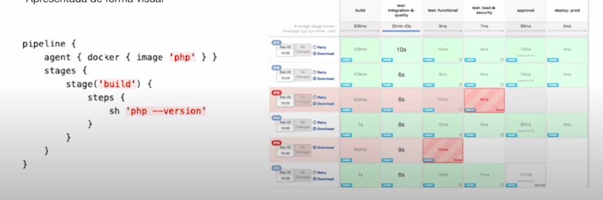

# Jenkins

- Trabalho com CI/CD
- Sistema de automação dos mais diversos tipos de tarefas;
- Criado em 2004, por um dev Java da Sun
- Chamava Hudson;
- Muitos plugins existentes;
- A cereja do bolo do Jenkins são os plugins, o que difere de outras ferramentas;

# Motivações

- Conter bugs nos códigos antes de entrar em produção;
- Execução de tarefas simples de forma totalmente manual;
- Ajuda no deploy contínuo e automatizado;
- Acompanhamento e métricas; (cada etapa do build)

# Funcionamento

- Desenvolvido em Java
- Uma arquivo WAR ou é executado através de um webserver (e.g. Tomcat);
- Vasta quantidade de plugins
- Gerenciamento de usuários
- Escala facilmente (podendo adicionar um novo node nas configs);
- **Suporte a pipelines e arquivo declarativo (Jenkinsfile);**

# No geral, o que o Jenkins normalmente faz na prática?

- Checkout da apluicação em um repositório logo após um commit;
- Executa processos de intergração contínua (build, test, performance, tarefas necessárioas para a verificação do com funcionamento do software);
- Gera um relatório apresentando todos os passos executados; (outputs)
- Realiza o processo de deplou de forma automatizada;
- Pode funcionar como uma **CRON com superpoderes**;

# Pipeline

- Trilha ou passo a passo com cada etapa de execução de uma tarefa;
- Pode ser criada pelo Jenkinsfile



# Instalação

Neste exemplo, vamos criar um `Dockerfile` responsável por gerar o Jenkins, neste caso é uma máquina Debian (padrão), e queremos basicamente executar algumas tarefas em PHP.

Vamos no Github pegar o Laravel framework, fazendo o checkout dele e instalar o Composer.

Porém o propósito e ver o pipeline rodando.

Vamos criar os arquivos `Dockerfile` e `docker-compose.yml` para subir uma máquina local com o Jenkins.

Logo, acese [http://localhost:8080](http://localhost:8080/), e aparecerá uma tela que estará solicitando uma senha, e esta senha estará dentro do `/var/jenkins_home/secrets/initialAdminPassword`, que deve estar dentro da pasta configurada no volume em Dockerfile.

Neste exemplo vamos assumir uma instalação padrão do Jenkins, que irá baixar todos os plugins básicos:


E após definir as outras configurações iremos nos deparar com a tela inicial do Jenkins:


## Conhecendo o básico da interface Jenkins

### Criar novo job

Acesse **New Item** para criarmos um novo job:

Neste exemplo vamos criar um **Pipeline:**

O nosso propósito é criar o job em formato pipeline, e esse job irá fazer o checkout do Laravel Framework, iremos dar o `composer install` e finalmente vamos rodar o PHPUnit em cima dele.


Na tela a seguit, vamos rolar até o **Pipeline script** (poderíamos informar um Jenkinsfile dentro do meu projeto, mas como não temos acesso ao projeto oficial do Laravel vamos escrever o script aqui neste campo).

Vamos criar um novo `stage` denominado `Git Checkout`, e neste estágio podemos adicionar alguns steps (via `steps`) ou adicionar comandos diretamente, que é o que iremos fazer. 

Logo após vamos adicionar os demais estágios, conforme a seguir:

```tsx
node {
    stage('Git Checkout') {
        git branch: 'master', url: 'https://github.com/laravel/framework.git'
    }
    
    stage('Composer') {
        sh 'composer install'
    }
    
    stage('PHPUnit') {
        sh 'vendor/bin/phpunit'
    }
}

```

Finalmente vamos testar este pipeline que criamos, clicando em **Build now:**


Agora podemos ver o pipeline sendo executado:


### Gerenciar Jenkins

Vamos supor que temos um repositório no GitHub e queremos fazer o checkout deste repositório para o Jenkins pra rodar algum processo e esse repositório é privado, então podemos acessar o menu **Manage Jenkins** e acessar o **Manage Credentials**


### Plugins

Acessado no menu **Manage Jenkins >> Manage Plugins** podemos ver a quantidade de plugins disponíveis paras o Jenkins.